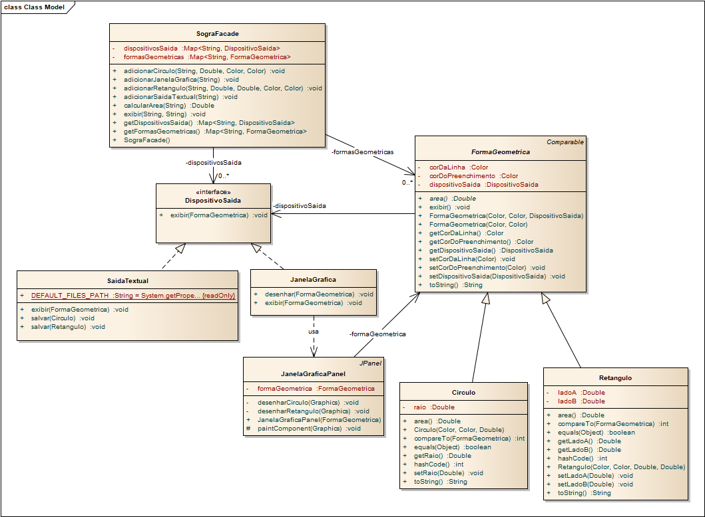

### SOftware de renderização GRAfica (SOGRA)

#### Breve Descrição

O software de renderização gráfica (SOGRA) é capaz de exibir formas geométricas em uma variedade de dispositivos de saída, como monitores, impressoras e projetores. 

Esta solução consiste em, INICIALMENTE, implementar um sistema de renderização que suporte três formas geométricas básicas: círculo, retângulo e triângulo. As formas têm em comum a cor de preenchimento e a cor da linha, que podem assumir os tons preto, branco, azul, verde ou vermelho. Além disso, devemos garantir que essas formas possam ser exibidas em, no mínimo, dois tipos de dispositivos de saída: uma janela gráfica e uma saída textual.

Porém, o sistema deve suportar uma arquitetura flexível e extensível que permita separar as abstrações das implementações concretas, além da adição de novas formas geométricas básicas e dispositivos de saída.

Dado esse contexto, crie um diagrama de classes, os testes e, em seguida, implemente o SOGRA. Para isto, pense claramente no relacionamento entre os objetos, a necessidade e as responsabilidades de cada um, mediante o padrão GRASP.

#### Veja o modelo de classes inicial para o projeto

